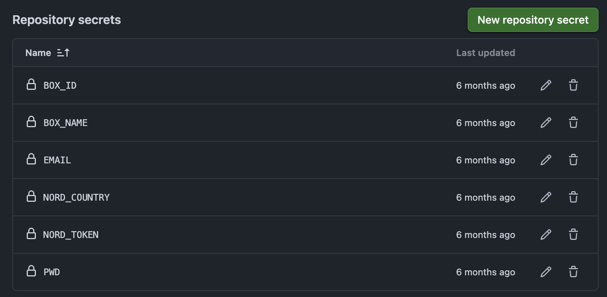
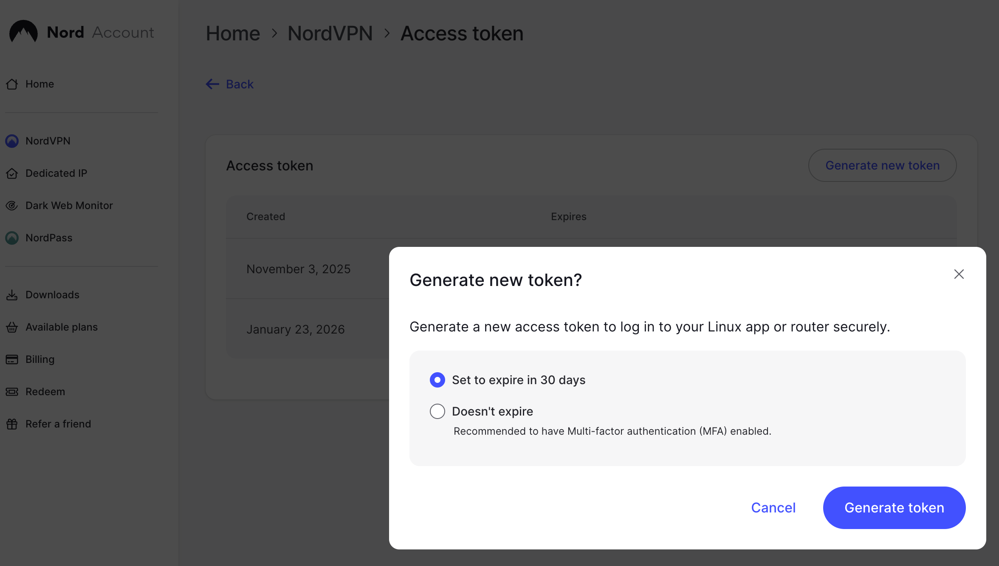
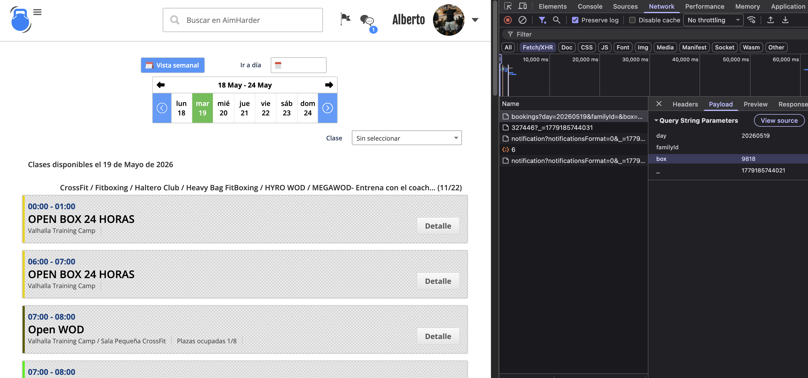
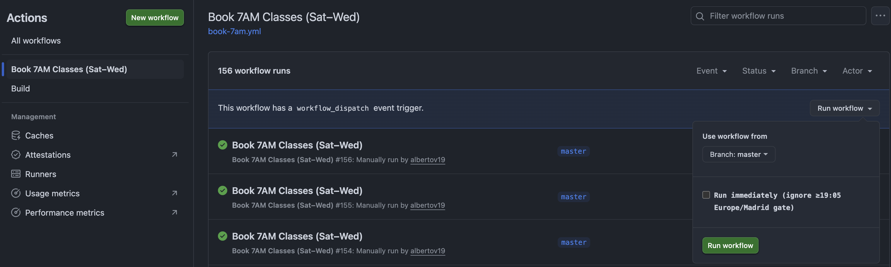

# aimharder-booking

Automated class booking for [aimharder.com](https://aimharder.com) gyms, running on GitHub Actions. Logs into the new `login.aimharder.com/api/login` flow, routes traffic through a Spain-based NordVPN exit, and books target classes ~36 hours before they start (the moment AimHarder's booking window opens).

Originally based on [pablobuenaposada/fitbot](https://github.com/pablobuenaposada/fitbot); the client has since been rewritten end-to-end to track AimHarder's current auth and booking endpoints.

---

## What it does

- Hits AimHarder's current JSON login endpoint and captures the `amhrdrauth` cookie.
- Warms up the box subdomain so a box-scoped `PHPSESSID` is established (required for the booking POST).
- Submits the booking with the headers and body shape a real Chrome session uses.
- Fails loudly on any non-success response — no more silent "Class booked successfully" lies.
- Runs from a Spain IP via NordVPN, since AimHarder geo-blocks most other regions on state-changing endpoints.

---

## How it works

```
┌────────────────────────────┐
│ GitHub Actions cron        │
│ 16:30 UTC (summer)         │
│ Sat–Wed for Mon–Fri 07:00  │
└──────────────┬─────────────┘
               │ wait until 19:05 Europe/Madrid
               ▼
┌────────────────────────────┐
│ Start NordLynx container   │
│ → SOCKS5 on 127.0.0.1:1080 │
│ → verify Spain exit IP     │
└──────────────┬─────────────┘
               ▼
┌────────────────────────────┐
│ python src/main.py         │
│  1. GET  login.aimharder.com/      (seed cookies)
│  2. POST login.aimharder.com/api/login  → amhrdrauth
│  3. GET  {box}.aimharder.com/schedule   (warm subdomain)
│  4. GET  {box}.aimharder.com/api/bookings?day=…
│  5. POST {box}.aimharder.com/api/book   ← the actual booking
└────────────────────────────┘
```

The 36-hour booking window opens at `class_time − 36h`. For a Wednesday 07:00 Madrid class that's Monday 19:00 Madrid; the workflow's gate waits until 19:05 Madrid to give a 5-minute safety margin.

---

## Setup

### 1. Required GitHub Actions secrets

In your repo: **Settings → Secrets and variables → Actions → New repository secret**.

| Secret | What goes in it |
|---|---|
| `EMAIL` | Your aimharder.com login email |
| `PWD` | Your aimharder.com password |
| `BOX_NAME` | Your gym's subdomain — the part before `.aimharder.com` in your schedule URL |
| `BOX_ID` | Your gym's numeric box ID (see *Finding your box ID* below) |
| `NORD_TOKEN` | NordVPN access token from [my.nordaccount.com/dashboard/nordvpn/access-tokens](https://my.nordaccount.com/dashboard/nordvpn/access-tokens/) |
| `NORD_COUNTRY` | `ES` for Spain (or any other two-letter code NordVPN supports) |
| `FAMILY_ID` | *Optional.* Member ID if your account books for multiple people |



The NordVPN token is generated from the access-tokens page in your Nord account:



### 2. Finding your box ID

1. Log into aimharder.com in a browser.
2. Open DevTools → **Network** tab, filter by `bookings`.
3. Navigate to your schedule. You'll see a request like `GET /api/bookings?day=...&box=XXXX`. The number after `box=` is your `BOX_ID`.
4. The subdomain right before `.aimharder.com` in that URL is your `BOX_NAME`.



### 3. Edit `booking_goals` for your gym

The workflow file (`.github/workflows/book-7am.yml`) defines `BOOKING_GOALS` inline:

```json
{
  "0": {"time": "0700", "name": "CrossFit"},
  "1": {"time": "0700", "name": "CrossFit"},
  "2": {"time": "0700", "name": "CrossFit"},
  "3": {"time": "0700", "name": "CrossFit"},
  "4": {"time": "0700", "name": "CrossFit"}
}
```

- Keys `0`–`4` are weekdays Monday→Friday (Python `datetime.weekday()`).
- `time` is the start time in `HHMM`.
- `name` is a **substring** that must appear in the class name. Pick something distinctive — if your gym calls the class `Crossfit Mañana` use `Crossfit`, not the full name.

If your gym's morning class isn't `CrossFit`, edit that string. If the times differ, edit `time`. If you don't want bookings on certain days, omit those keys.

### 4. Match the cron to your target time

The cron in `book-7am.yml` is tuned for Madrid 07:00 classes:

```yaml
# summer (CEST / UTC+2)
- cron: "30 16 * * 6,0-3"   # 16:30 UTC = 18:30 Madrid, gate waits until 19:05
# winter (CET / UTC+1) — swap to this twice a year
# - cron: "30 17 * * 6,0-3"
```

For a different class time, shift the cron by the same offset so the run lands at `class_time − 36h − 5min`. For example, to book a **19:00 Madrid class** you want the run to start at ~**07:00 Madrid the previous day**, and `DAYS_IN_ADVANCE=1` (since `datetime.today() + 1 day` lands on the class date).

> Mental model: `DAYS_IN_ADVANCE` is the number of calendar days from when the run fires to when the class is. Run on Saturday morning to book Monday class → 2 days. Run on Tuesday morning to book Wednesday class → 1 day.

### 5. (Built-in) HYRO Tue/Wed rotation

The workflow has a small bash step that flips Tuesday's or Wednesday's `name` to `HYRO WOD` depending on ISO week parity (odd weeks → Tuesday, even weeks → Wednesday). If your gym doesn't run this rotation, delete the "Build booking goals" step.

---

## Manual trigger

Actions tab → **Book 7AM Classes (Sat–Wed)** → **Run workflow** → leave `force_run` unchecked for a normal run, or check it to bypass the 19:05-Madrid gate (useful for credential testing). Successful runs show up as green checkmarks in the workflow list — those green rows are your "it actually booked" indicator.



---

## Troubleshooting

The script logs the key fields in plain language. Look for these lines in the Actions log:

| Log line | Meaning |
|---|---|
| `Login response: ... cookies=[..., 'amhrdrauth@.aimharder.com', ...]` | Auth worked, you're in. |
| `Login did not set amhrdrauth cookie (body[:200]=...)` | Login rejected. Body shows why — usually bad credentials or the endpoint changed again. |
| `Warmup response: ... cookies=[..., 'PHPSESSID@{box}.aimharder.com', ...]` | Box-scoped session established. |
| `Class booked successfully` | Done. |
| `Too soon to book the class` (bookState=-12) | Cron fired too early; push it back. |
| `No credit available` (bookState=-2) | Pay your gym. |
| `Session rejected by server (logout)` | The booking POST was rejected as unauthenticated. Almost always means login regressed — re-capture the browser cURL and diff. |
| `Class already booked. Nothing to do` | Another run already grabbed the spot, or you booked manually. |

### Daylight saving

Spain switches between CET (UTC+1) and CEST (UTC+2). The workflow's cron is in UTC, so it doesn't auto-adjust. Twice a year, flip the commented/uncommented cron lines in `book-7am.yml`.

### NordVPN connection

If `❌ Proxy not ready after 60 attempts` shows up:

- Token might be expired — generate a new one at the NordVPN dashboard.
- The country might be saturated — try `FR` or `PT` (still close enough to Spain that AimHarder won't 403, usually).

---

## Local run (optional, for debugging)

```bash
uv sync
python src/main.py \
  --email "$EMAIL" \
  --password "$PASSWORD" \
  --box-name "$BOX_NAME" \
  --box-id "$BOX_ID" \
  --booking-goals "$BOOKING_GOALS" \
  --days-in-advance 2 \
  --proxy "socks5://127.0.0.1:1080"
```

You'll need a Spain-based SOCKS5 proxy locally for the request to not get geo-blocked.

---

## Security notes

- All credentials live in GitHub Actions secrets, never in code.
- The `fingerprint` sent on login is a stable SHA-256 of your email's first 50 hex chars — same value every run so AimHarder doesn't see us as a "new device" each time. If they ever require device verification, you'll need to log in once via a browser to authorise the fingerprint.
- The Actions log shows cookie *names* but never values. Body excerpts on the booking response are capped at 200 chars and stripped of full PII; tighten these further if you make the repo public.

---

## Credits

Started as a fork of [pablobuenaposada/fitbot](https://github.com/pablobuenaposada/fitbot), which laid out the original CLI shape and booking-window logic. The current client targets AimHarder's post-2026 auth flow and is essentially a rewrite.
